# mysecondproject
mMy second project is a musical quiz, consisting of 10 questions based around the music genre 'metal'.
Metal is a expansive genre with many sub genres, I have used a variance of questions from many eras.

## contents
* [Rationale](#rationale)

* [User Experience](#user-experience-ux)

* [Design](#design)

* [Features](#features)

* [Technologies Used](#technologies-used)

* [Deployment](#deployment)

* [Testing](#testing)

* [Credits](#credits)

## Rationale

### project introduction
A opportunity to test your metal across 10 questions with something for everyone.

### motivation and inspiration
As a former guitarist in a metal band, Music is a huge part of my life. Although im no longer in a band I still love going to shows and taking in the atmosphere from the crowd. whether its a local band or an arena headliner, you will always find me at a show with a big smile on my face. Metal is generally my music of taste so whether you are new to the genre, or a life long fan, this quiz is for you.

### project scope and limitations
The primary audience for this quiz includes metal music enthusiasts across all experience levels, from casual listeners, to die-hard fans. A secondary audience includes curious newcomers who are interested in exploring the game in a fun, and testing their knowledge in a fun way. 
My known limitation for this quiz is that I don't have an expansive pool of data for questions. I have the same 10 questions so if so inclined the user could research the questions or learn the pattern to ace the quiz.

### competitor research
During the planning stage, I explored existing metal music quizes. Many seemed outdated, visually unappealing, or not responsive on smaller devices. Few offered an aesthetic that reflects the culture of metal music. Seeing this gap I set out to create a quiz that is not only technically functional, but also visually appealing. This is my unique selling point, and i feel that it offers an enhanced experiance for my target audience.

### personal development
This project has been a valuable learning journey. It has deepened my understanding of responsive design, javascript event handling, and web accessibility. I have also developed my project planning and debugging skills. It has also taught me the value of aligning personal interests, and technical skills to create meaningful user centric projects. This experience has strengthened my confidence as a Developer and enhanced my foundation for further projects.

## user experience

### site goals
* the aim of website to be user friendly and work on a range of devices.
* I want the website to be fully interactive and the quiz to reset upon completion, should the person want another go to improve their score.
* To create an asthetically pleasing website, that matches the look and feel associated with the genre.
* To create a website that works on a range on devices.

### user stories

#### owner goals
* To be able to view the site on various devices.
* To test the knowledge people have with metal music.
* To be user friendly.
* To allow people to test their knowledge.

#### first time visitor goals
* To allow me to test the knowledge I have with metal music.
* I want to be able to navigate the site easily to find information.
* I want to be able to find social media for the Developer.

#### returning visitors
* I want to see if I can improve my score.
* I want to see if the developer has other games.

### project background and motivation

* The inspiration for this project stems from my passion for music, particularly the metal genre, which has been a significant part of my life. Metal music, with its rich history and diverse subgenres, has always been a source of excitement and connection for fans worldwide. This project aims to celebrate that passion by creating an engaging and interactive quiz that tests users' knowledge of metal music, offering both entertainment and a sense of community for like-minded individuals.

* The motivation behind this project was to provide a platform that is accessible to everyone, regardless of their level of familiarity with the genre. Whether someone is a long-time fan, or just beginning to explore metal music, the quiz is designed to be inclusive and enjoyable. By focusing on usability across a range of devices, the project ensures that users can participate anytime, anywhere, making it a convenient and fun experience.

* Additionally, this project serves as an opportunity to develop and showcase my skills in web development. From designing a user-friendly interface to implementing responsive features, the process of building this quiz has been both challenging and rewarding. It reflects my commitment to creating digital experiences that are not only functional, but also visually appealing and aligned with the culture and aesthetics of the metal music community.

* Ultimately, the goal of this project is to bring people together through their shared love of music, while providing a platform that is both entertaining and educational. By combining my personal interests and my technical skills, I hope to create a meaningful and memorable experience for users.

### Strategic value and long-term Vision

* This project holds significant strategic value as it combines entertainment with education, fostering a sense of community among metal music enthusiasts. By creating an engaging and accessible platform, the quiz not only entertains users, but also promotes the rich history and diversity of the metal genre. This aligns with the broader goal of celebrating niche interests and connecting like-minded individuals through interactive digital experiences.

* In the long term, the vision for this project extends beyond its current scope. Future enhancements could include expanding the question pool by integrating a dynamic database, allowing for a more diverse and personalized user experience. Additionally, incorporating features such as user-generated content, leaderboards, and social sharing options could further increase user engagement and retention.

* Ultimately, this project demonstrates the potential of combining technical skills with personal passion, to create meaningful digital experiences. It reflects a commitment to innovation, user-centric design, and the celebration of cultural niches, paving the way for future projects that inspire and connect communities.

### Problem Statement

* Metal music is a genre with a rich history and a passionate fan base, yet there are limited interactive platforms that allow fans to test their knowledge and engage with the culture in a meaningful way. Many existing quizzes or games lack inclusivity, accessibility, and a focus on the unique aesthetics and diversity of the metal genre. This creates a gap for fans who want an engaging, community-driven experience that celebrates their love for metal music.

* Additionally, users often face challenges with poorly designed or non-responsive platforms, that fail to provide a seamless experience across different devices. This limits the ability of users to participate conveniently, whether they are at home or on the go. For developers, there is also a need for projects that not only entertain, but also showcase technical skills in creating functional, visually appealing, and user-friendly web applications.

* This project seeks to address these issues by creating a responsive, inclusive, and engaging quiz platform that celebrates the metal music genre, while providing an enjoyable experience for users of all backgrounds and levels of familiarity with the genre.

### Design and Technical Challenges

Creating a responsive and engaging quiz platform presented several design and technical challenges that required careful consideration and problem-solving:

1. **Responsive Design Across Devices**  
   Ensuring the quiz works seamlessly on a variety of devices, from desktops to smartphones, was a key challenge. This required implementing a responsive layout using CSS media queries and testing the design on multiple screen sizes to ensure usability and consistency.

2. **User-Friendly Interface**  
   Designing an interface that is intuitive and visually appealing, while aligning with the rugged aesthetics of the metal music genre was another challenge. Striking the right balance between functionality and thematic design required iterative prototyping and user feedback.

3. **Dynamic Quiz Functionality**  
   Implementing the quiz logic to handle user interactions, track scores, and reset the quiz for replayability posed technical challenges. This involved writing efficient JavaScript code to manage state and ensure a smooth user experience.

4. **Accessibility**  
   Making the quiz accessible to all users, including those with disabilities, was a priority. This required adhering to web accessibility standards, such as providing proper semantic HTML, keyboard navigation, and sufficient color contrast.

5. **Limited Question Pool**  
   With only 10 questions available, ensuring the quiz remains engaging for returning users was a challenge. This highlighted the need for future enhancements, such as dynamically loading questions from a larger database or allowing user-generated content.

6. **Performance Optimization**  
   Ensuring the site loads quickly and performs well, even on slower connections, required optimizing images, minimizing JavaScript, and leveraging browser caching.

7. **Testing and Debugging**  
   Identifying and resolving bugs across different browsers and devices was a time-consuming process. This involved extensive manual and automated testing to ensure the quiz functions as intended under various conditions.

By addressing these challenges, the project not only delivered a functional and engaging quiz, but also provided valuable learning experiences in web development and design.

### Technological Choices and Justification

The development of this project required careful selection of technologies to ensure the quiz platform was functional, responsive, and visually appealing. Below are the key technologies used and the justification for their selection:

1. **HTML5**  
   HTML5 was chosen as the foundation for structuring the content of the quiz. Its semantic elements, such as `<header>`, `<section>`, and `<footer>`, helped create a well-organised and accessible structure, improving both usability and SEO.

2. **CSS3**  
   CSS3 was used for styling the quiz and ensuring a visually appealing design. Features like media queries enabled responsive design, allowing the quiz to adapt seamlessly to different screen sizes. CSS animations were also utilised to enhance user engagement.

3. **JavaScript (Vanilla)**  
   JavaScript was selected for implementing the quiz logic, including handling user interactions, tracking scores, and resetting the quiz. Using vanilla JavaScript ensured lightweight and efficient code without relying on external libraries.

4. **Git and GitHub**  
   Git was used for version control, allowing for efficient tracking of changes and collaboration. GitHub served as the hosting platform for the project, providing an accessible and reliable way to deploy the quiz online.

5. **Google Fonts**  
   Google Fonts was used to incorporate typography that aligns with the rugged and bold aesthetics of the metal music genre. This added a unique visual identity to the quiz.

6. **Figma**  
   Figma was used for designing wireframes and prototyping the layout of the quiz. This tool allowed for iterative design and ensured the final product met user expectations.

7. **Chrome DevTools**  
   Chrome DevTools was utilized for debugging and testing the quiz across different devices and screen sizes. This ensured consistent performance and design.

8. **W3C Validator**  
   The W3C Validator was used to check the HTML and CSS code for errors and ensure compliance with web standards, improving the overall quality and accessibility of the project.

By leveraging these technologies, the project achieved its goals of creating a responsive, engaging, and user-friendly quiz platform while adhering to modern web development practices.

## design

### colour Scheme

This website uses a pallete of; black, dark grey, off white, green and red. The quiz has a dark but certain aesthetic often associated with metal music. green and red are then used to show true or false within the quiz.
The colour palette was created using the [Coolors](https://coolors.co/) website.

### Typography

The website uses typography that aligns with the rugged and bold aesthetics of the metal music genre. The following font was selected from [Google Fonts](https://fonts.google.com/):

1. **Bebas Neue** - Used for headings and other text elements to create a bold and impactful look.

This font was chosen to compliment the dark and edgy theme of the quiz, whilst maintaining clarity and usability.

### imagery

The background image has been used from (https://www.pexels.com/) 
(https://cloudinary.com/) for changing to webp file.

# wireframes

## wireframes for laptop, tablet and phone sized screens

### laptop

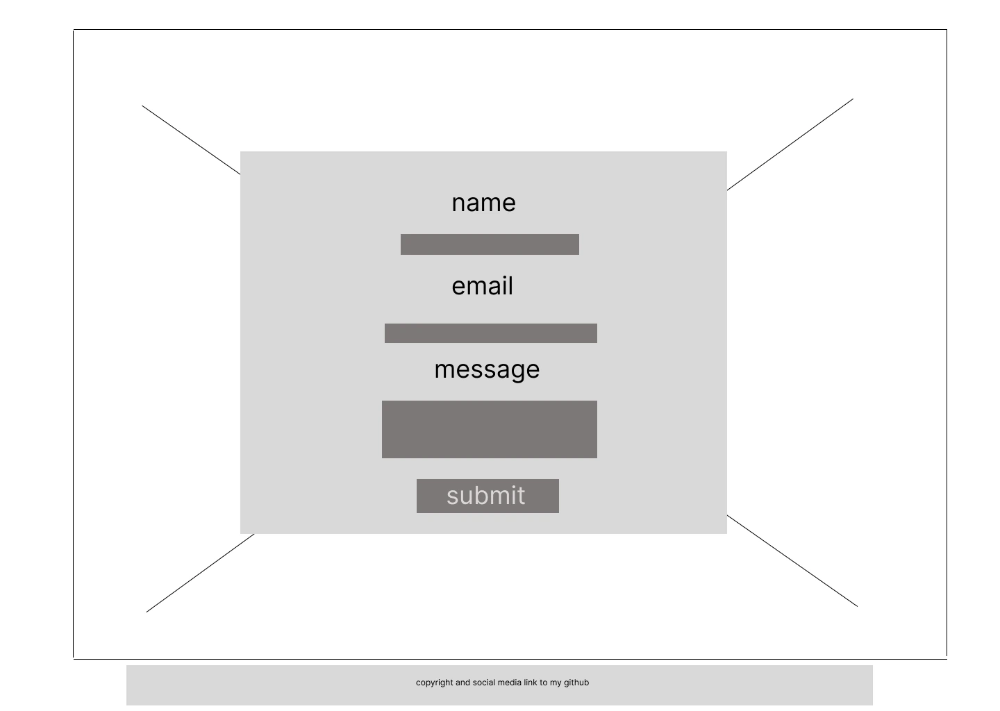
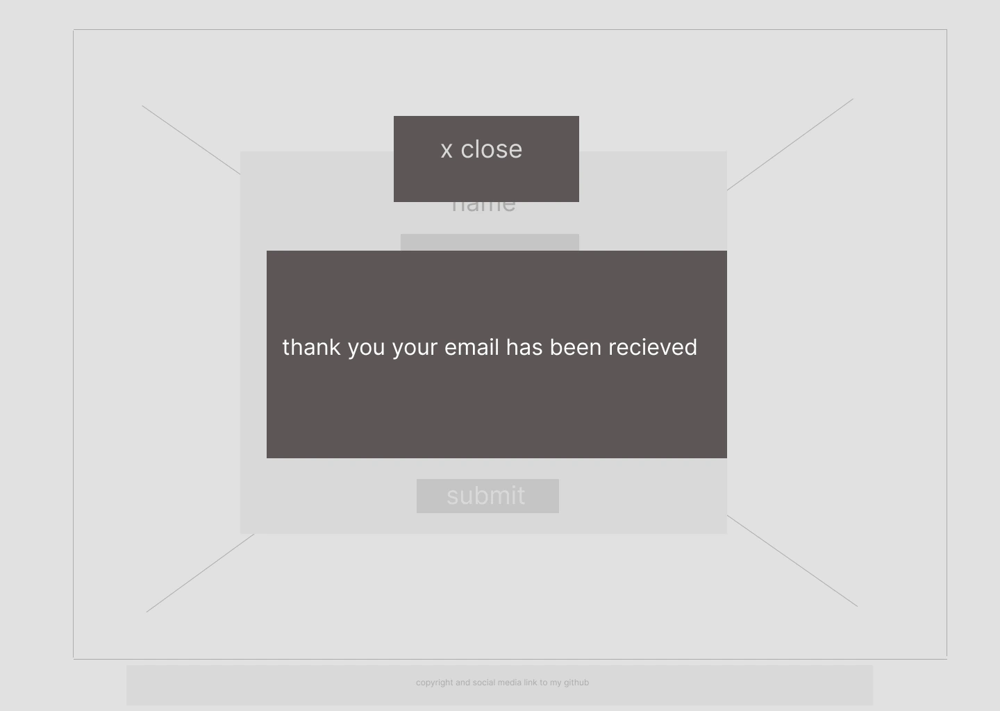

### tablet
 
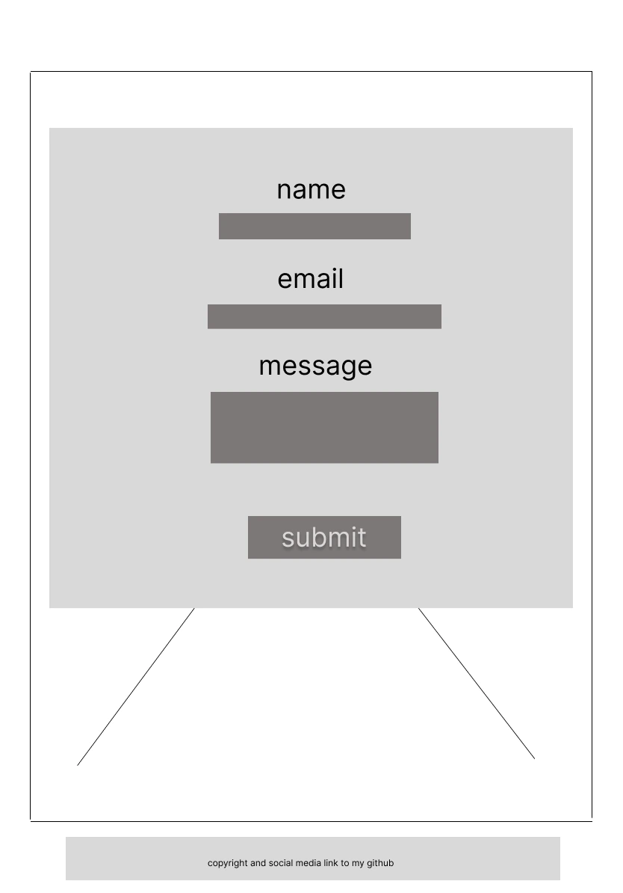
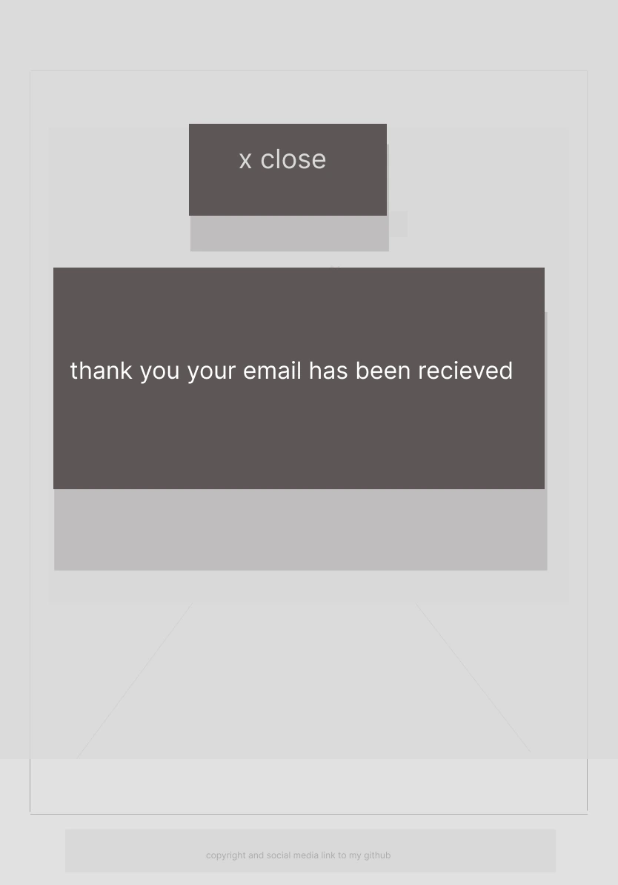

### mobile
 
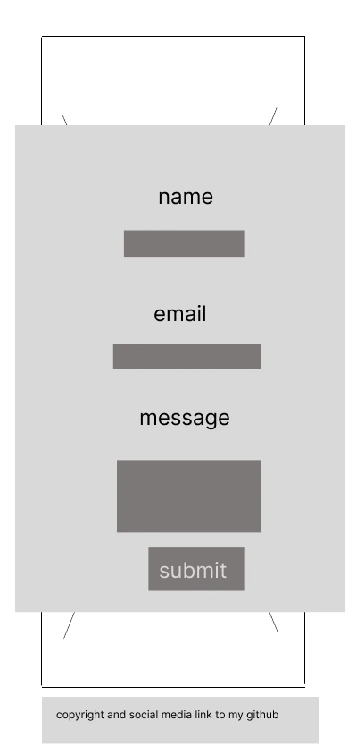

## features
This website only uses a landing page so I didn't create a sitemap

### general features
* A favicon in the browser tab 

* A score to be displayed when taking the quiz 

* A footer showing a copyright and link to my github 

### future implementations
* To create a larger pool of questions to randomise what question comes next and to create a bigger challange.
* Add a scoreboard so you can see how you do against friends and family.
* Add different difficulties for beginners and experts.
* Integration of API or custom database to randomise questions.
* 'Challange a friend feature', which would link through social media.
* Community submissions (moderated).
* Leaderboards and achievement badges to incentivise return visits.

I believe these enhancements would transform the quiz from a one time experiance to a dynamic platform.

### accessibility
* I have used alt attributes on images.
* I have used a hover state on buttons to make it clear if they are being hovered over.
* I have used semantic HTML. 
* I have made sure there is colour contrast on the site. 

## technologies used
* html 5
* css 3
* javascript

### frameworks
* [Figma](https://www.figma.com/) - Used to create wireframes.
* [Git](https://git-scm.com/) - For version control.
* [Github](https://github.com/) - To save and store the files for the website.
* [visual studio](https://code.visualstudio.com/) - IDE used to create the site.
* [Google Fonts](https://fonts.google.com/) - To import the fonts used on the website.
* [Favicon.io](https://favicon.io/) To create favicon.
* [Am I Responsive?](http://ami.responsivedesign.is/) To show the website image on a range of devices.
* [Google Developer Tools](https://developers.google.com/web/tools) - To troubleshoot and test features, solve issues with responsiveness and styling.
* [pexels](https://www.pexels.com/) - for hero image
* [cloudinary](https://cloudinary.com/) - for image conversion to webp
* [w3c validation](https://www.w3.org/) - for validating code (html and css)
* [jshint](https://jshint.com/) - for validating javascript.
* [wave](https://wave.webaim.org/) - for avalidating accessibility.

## deployment & local development

### deployment

Github Pages was used to deploy the live website. The instructions to achieve this are below:

1. Log in to Github.
2. Find the repository for this project, mysecondproject.
3. Click on the Settings button.
4. Click on the Pages button in the left hand side bar.
5. In the Source section, choose main from the drop down select branch menu. Select Root from the drop down select folder menu.
6. Click Save. Your live Github Pages site is now deployed at the URL shown.

### local Development

The local development section gives instructions on how someone else could make a copy of your project to play with on their local machine. This section will get more complex in the later projects, and can be a great reference to yourself if you forget how to do this.

### how to Fork

To fork music quiz repository:

1. Log in to Github.
2. Go to the repository for this project, danielkepinski/mysecondproject
3. Click the Fork button at the top of the page between Watch and Starred.

### current version

See images of current version of website across devices.

* Desktop  

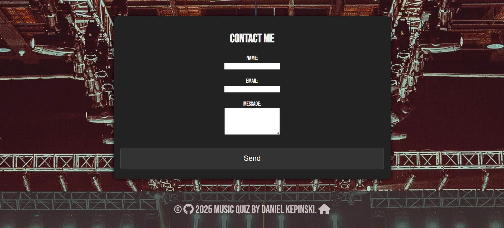

* Tablet  
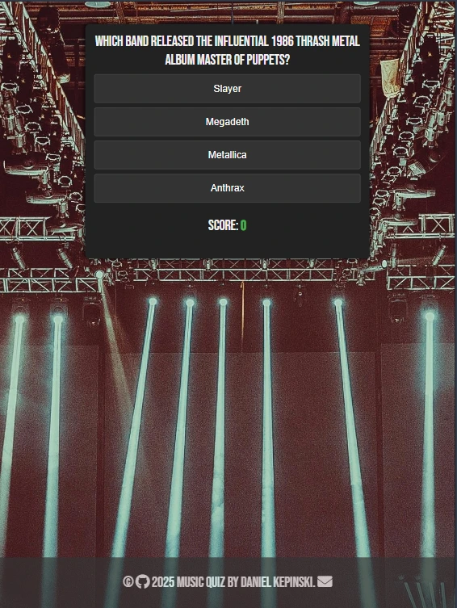
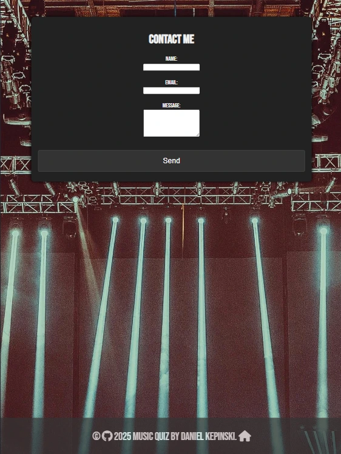
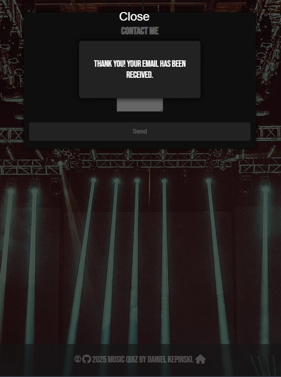

* Mobile device  

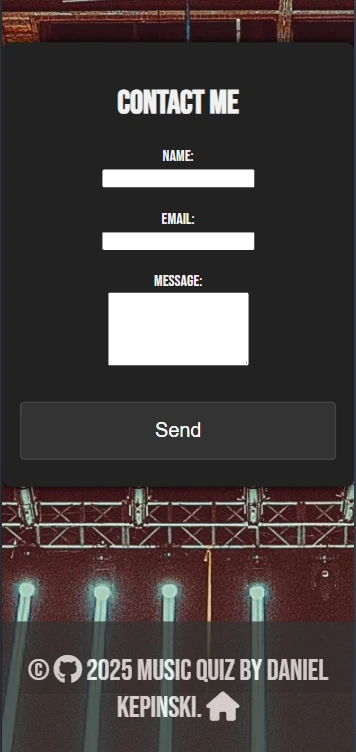
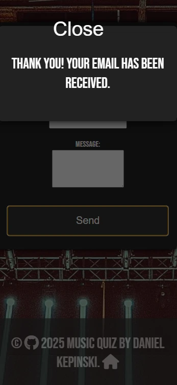

## testing

Testing has been ongoing throughout the build with Chrome developer tools.

### lighthouse
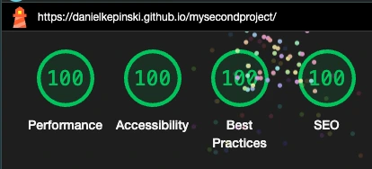 
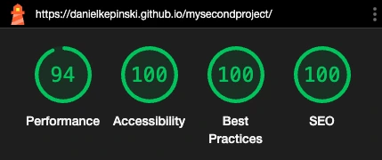

### wave
No errors with accessibility 
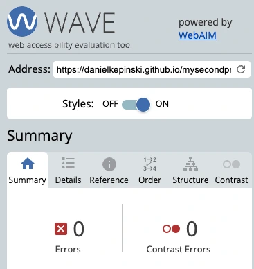

### w3c validator
I used w3c validator to check and validate all my pages on for my website. This was also used to validate my CSS in style.css file

* I had a note on w3c validator about a space however, I didnt have any errors 

* I did not have any errors with my css. 

### jshint
I also used a website called jshint to validate my javascript code.
* The screenshot shows two unused variables, however this is because the validator cannot see my html page, and this calls the js into action. 
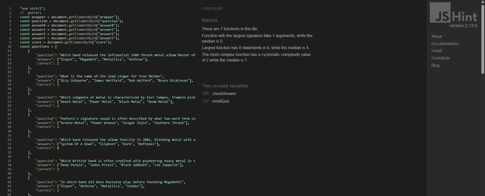

### manual testing
* I clicked the github icon and it took my to my github page
* When clicking the email icon it took me to my contact form page
* The quiz does not start till the first question is clicked
* I cannot spam click the questions to speed run the quiz

### solved bugs
* I was having an issue again with my footer and the background image and a black bar being present. I found that this was due to my background image not stretching far enough.
I chnaged this in my styling within css.
* My resetQuiz button was only resetting the score, resulting in the user having to use f5 or however they may choose to refresh their browser. I have changed the code so not only does it reset the score, but it also refreshes the page.

### known bugs
* If a user repeatedly clicks on a particular answer button, the input is registered before the next question is displayed. This allows the quiz to be completed in just a few seconds. This issue has been observed across all tested devices, including laptops, desktop PCs, Android smartphones, and iPhones.

## credits

### content
Content for the website with written by myself.

### media 
[Dawn Lio - Lights in the arena](https://www.pexels.com/photo/lights-in-the-arena-2177814/) - background image

### acknowledgements
* Tutor support at Code Institute 
* My mentor Spencer Barriball
* My wife for checking my spelling and punctuation.